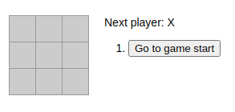
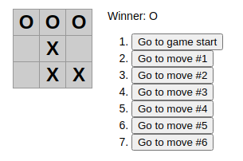

# TUTORIAL REACTJS - from official website.

A game to introduce the basics concepts in ReactJs

 

 

Commands to run (linux-ubuntu):

Run Terminal (crtl + alt + t) 

Go to your project folder:

- npx create-react-app my-app
- npm start

Open your browser and type http://locathost:3000

### The Official website is:

https://reactjs.org/tutorial/tutorial.html

